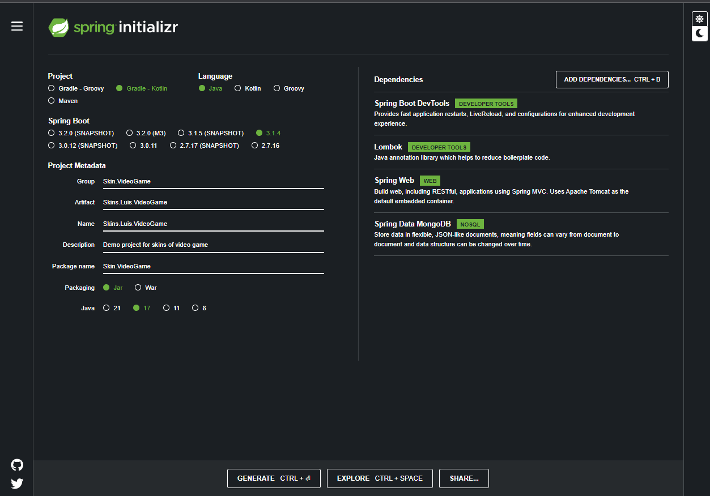

### ApiRestCrud-SkinsVideojuego - Prueba BackEnd Hackathon JUMP2DIGITAL

## Opciones para descargar el proyecto:
-  Puede descargar el proyecto en formato Zip.
-  clonando desde la consola de comandos de git con el comando git clone https://github.com/Luiso-o/ApiRestCrud-SkinsVideojuego.git

## Importante antes de usar la API:

## Versiones necesarias:
- Gradle 8.1.1
- JDK 17.0.1
- Kotlin 1.8.10
- SpringFramework.boot 3.1.4

## Importante:
- Es posible que si trabajas con Lombok tengas problemas con la nueva version, no es compatible
  con la version actual de Lombok, trabaja son un ide diferente o con una version anterior a la
  nueva de Intellij.

- Si quieres usar la versión actual te recomiendo descargar el pluguin de Lombok https://github.com/mplushnikov/lombok-intellij-plugin 

## Base de datos mongoDB
- Server localhost : 27017

## Estructura primigenia

